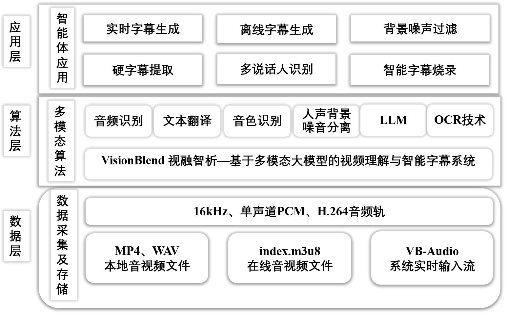
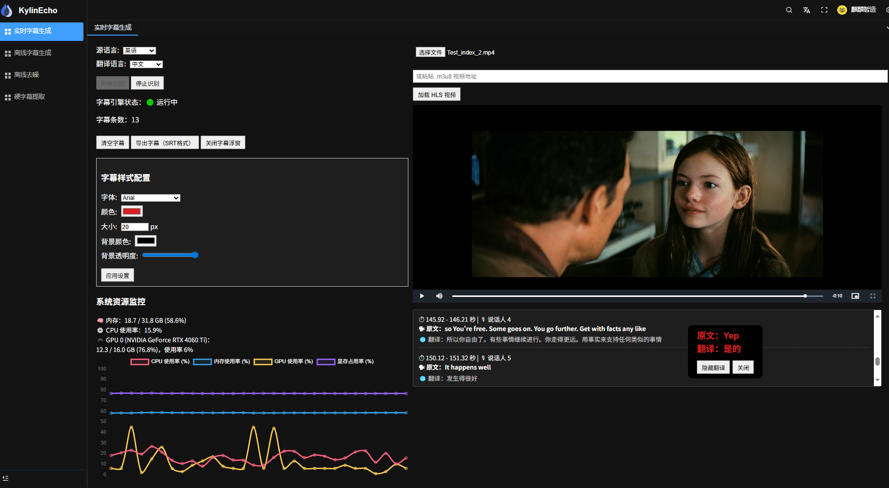
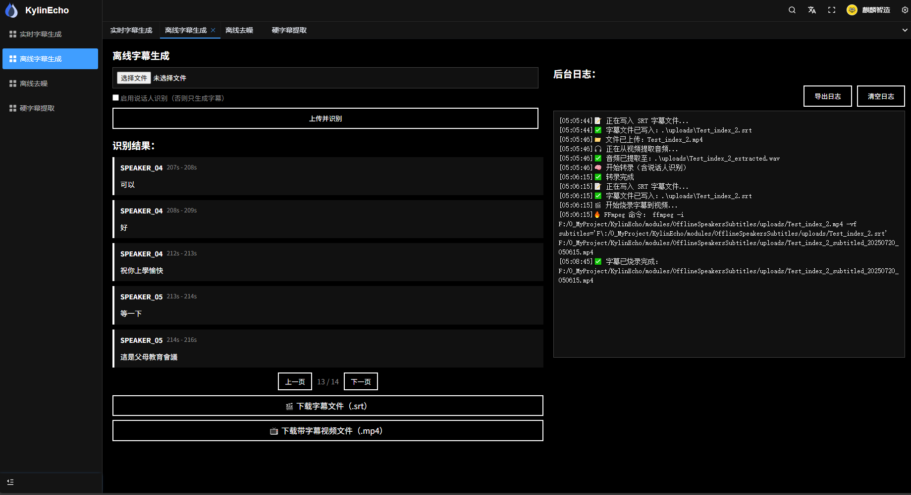
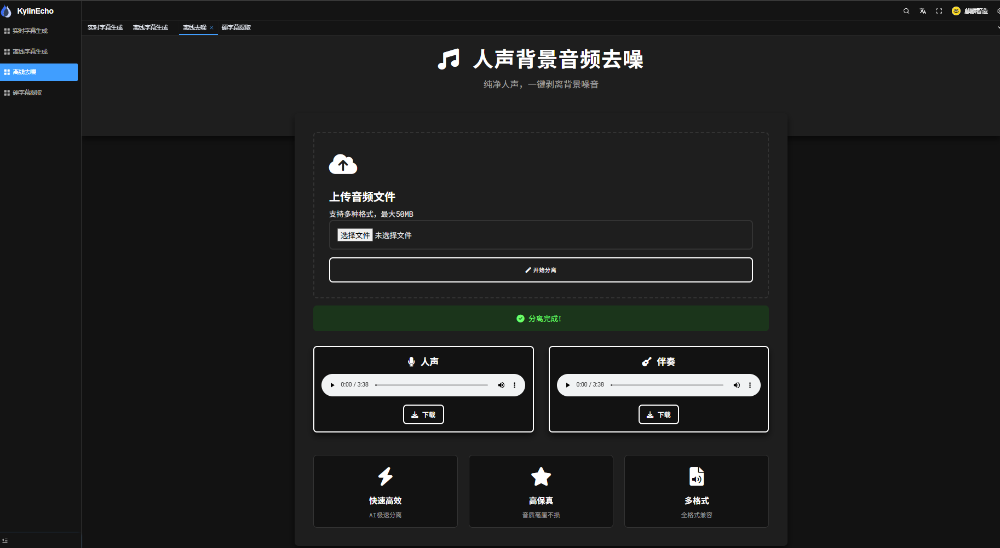
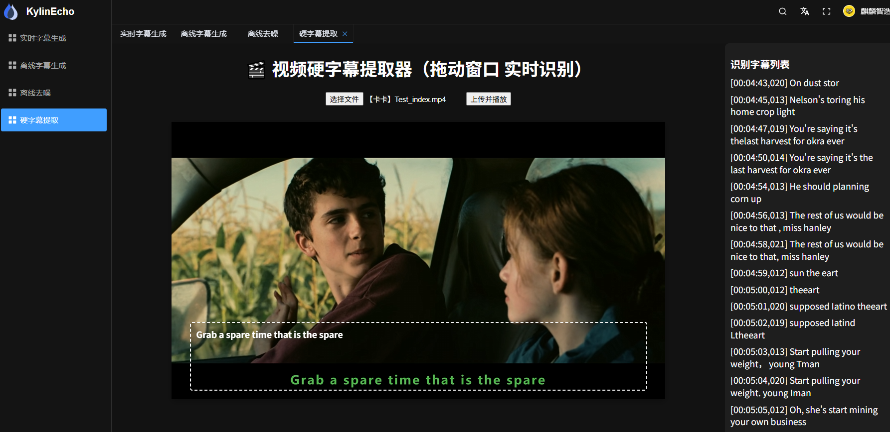

# KylinEcho

<div align="center">

**VisionBlend · 基于多模态大模型的视频理解与智能字幕系统** | **Video Understanding & Intelligent Subtitling System**

[](https://opensource.org/licenses/MIT)
[](https://nodejs.org/)
[](https://pnpm.io/)
[](https://vuejs.org/)

</div>

---

## 📖 项目介绍 | Project Overview

KylinEcho（**VisionBlend 视融智析**）是一个基于**多模态大模型**的**视频理解与智能字幕系统**，集成了现代化的 Web 前端、Electron 桌面应用，以及高效的 AI 视频处理能力。系统面向教育、直播、跨国协作、媒体制作等场景，实现视频语音的实时识别、字幕自动生成与时间轴同步、多语言翻译切换，以及智能内容剪辑。

KylinEcho (**VisionBlend**) is a **video understanding and intelligent subtitling system** built on **multimodal large language models**. It combines a modern web frontend, an Electron desktop app, and efficient AI video processing. The system targets education, live-streaming, cross-language collaboration, and media production, delivering real-time speech recognition, automatic subtitle generation with timeline synchronization, multi-language translation, and intelligent content editing.

### ✨ 核心特性 | Key Features

- 🎬 **实时字幕生成** - Real-time subtitle generation from live video/audio streams (<1s latency)
- 📼 **离线视频分析** - Offline video processing with speaker diarization & subtitle burn-in
- 🔇 **人声背景降噪** - AI-based vocal / background-audio separation (MDX models)
- 📝 **硬字幕提取** - OCR extraction of burned-in subtitles with draggable region
- 🗣️ **多说话人分离** - Multi-speaker identification and independent subtitle streams
- 🌍 **多语言实时互译** - Real-time translation across 9 languages (中/英/日 …)
- 🖥️ **跨平台支持** - Web UI + Electron desktop application
- 📊 **资源监控看板** - Live CPU / GPU / memory dashboard with dynamic visualization

---

## 🏗️ 系统架构 | System Architecture

系统采用「数据层 — 算法层 — 应用层」三层架构。多模态算法层融合音频识别、文本翻译、音色识别、人声/背景噪声分离、LLM 与 OCR 能力，向上支撑实时字幕生成、离线字幕生成、背景噪声过滤、硬字幕提取、多说话人识别、智能字幕烧录六大应用。



| 层级 | 组成 |
|------|------|
| **应用层** Application | 实时字幕生成 · 离线字幕生成 · 背景噪声过滤 · 硬字幕提取 · 多说话人识别 · 智能字幕烧录 |
| **算法层** Algorithm | 音频识别 (Paraformer-large / Whisper) · 文本翻译 (LLM) · 音色识别 · 人声/背景噪声分离 (MDX) · OCR (PaddleOCR) |
| **数据层** Data | MP4/WAV 本地音视频 · index.m3u8 在线流 · VB-Audio 系统实时输入流 · 16kHz 单声道 PCM |

---

## 🖼️ 系统案例展示 | Screenshots & Demo

> 完整演示视频见本地文件：`Material/操作系统_基于openKylin和多模态智能字幕生成系统.mp4`
> 示例素材见 `example/`（实时 / 离线 / 硬字幕 / 音频 测试用例）。

### 1️⃣ 实时字幕生成 | Real-time Subtitle Generation

支持源语言/翻译语言选择、字幕样式实时配置、说话人识别，以及内存/CPU/GPU 资源监控看板。



### 2️⃣ 离线视频分析 | Offline Video Analysis

上传本地视频后自动分离音视频、识别多说话人，生成带说话人标记与时间戳的字幕，并导出 `.srt` 与烧录字幕的 `.mp4`。



### 3️⃣ 人声背景音频去噪 | Vocal & Background Separation

基于 MDX 模型一键分离人声与背景噪声，支持 MP3/WAV 上传与分离结果在线试听、`.wav` 下载。



### 4️⃣ 硬字幕提取 | Hard-subtitle OCR Extraction

通过可拖拽的 OCR 识别框实时提取视频内嵌字幕，输出带时间戳的字幕列表并支持 `.srt` 导出。



---

## 🛠️ 技术栈 | Tech Stack

### Frontend Stack
- **Core Framework**: Vue.js 3.5+, Vite 6.3+
- **UI Framework**: Element Plus 2.9, Tailwind CSS 4.1
- **State Management**: Pinia 3.0
- **Type Safety**: TypeScript 5.8
- **Routing**: Vue Router 4.5
- **Internationalization**: Vue i18n 11.1

### Desktop Application
- **Framework**: Electron 37.2
- **Build Tool**: Vite 7.0

### Development Tools
- **Linting**: ESLint 9.25 + Prettier 3.5 + Stylelint 16.18
- **Testing**: TypeScript compiler + vue-tsc
- **Build**: Tailwind CSS 4.1 + PostCSS
- **Git Hooks**: Husky + Lint-staged + Commitlint

### AI Backend (Python)
- **ASR / Speech**: `faster-whisper`, `pyannote.audio` (speaker diarization), DashScope (Qwen)
- **Translation / LLM**: `dashscope`, `transformers`
- **OCR**: `je-paddleocr`, `paddlepaddle`, `paddle2onnx`
- **Audio & Vision**: `PyAudio`, `opencv-python`, `pysrt`, FFmpeg pipeline
- **Inference Runtime**: `onnxruntime-gpu` / `onnxruntime-directml`
- **Service**: `flask`, `flask-socketio` (WebSocket realtime streaming)

See [`modules/requirements.txt`](modules/requirements.txt) for the full list.

---

## 🚀 快速开始 | Quick Start

### 前置要求 | Prerequisites

- Node.js: `^18.18.0` || `^20.9.0` || `>=22.0.0`
- pnpm: `>=9`

### 安装 | Installation

```bash
# Clone the repository
git clone https://github.com/Zjomo/KylinEcho.git
cd KylinEcho

# Install dependencies
pnpm install
```

### AI 后端 | AI Backend (Python)

Each functional module runs as an independent Python service (`app.py`). Create an environment and install the requirements, then start the modules you need:

```bash
# Install Python dependencies
pip install -r modules/requirements.txt

# Start individual AI services
python modules/RealtimeClient/app.py            # 实时字幕生成
python modules/OfflineSpeakersSubtitles/app.py  # 离线视频分析
python modules/AudioDenoising/app.py            # 人声背景去噪
python modules/HardSubtitleExtraction/app.py    # 硬字幕提取
```

> On Windows you can launch the frontend + Electron + all AI services at once via [`modules/run_script.bat`](modules/run_script.bat) (edit the `PYTHON_PATH_*` variables to point at your environment first).

### 开发 | Development

```bash
# Start development server
pnpm dev

# Run with debug mode
NODE_OPTIONS=--max-old-space-size=4096 pnpm dev

# Run Electron desktop application
cd modules/SystemElectron
pnpm electron:serve

# Type checking
pnpm typecheck

# Code quality checks
pnpm lint          # Run all linters
pnpm lint:eslint   # ESLint
pnpm lint:prettier # Prettier
pnpm lint:stylelint # Stylelint
```

### 构建 | Build

```bash
# Production build
pnpm build

# Staging build
pnpm build:staging

# Preview build
pnpm preview:build
```

---

## 📁 项目结构 | Project Structure

```
KylinEcho/
├── src/                          # Main web application source (Vue 3)
├── modules/                      # AI backend modules (Python)
│   ├── RealtimeClient/           # 实时字幕生成引擎
│   ├── OfflineSpeakersSubtitles/ # 离线视频分析 + 多说话人字幕
│   ├── AudioDenoising/           # 人声背景音频去噪
│   ├── HardSubtitleExtraction/   # 硬字幕 OCR 提取
│   ├── VideoAIClip/              # 智能视频剪辑
│   ├── SystemElectron/           # Electron 桌面应用
│   ├── models/                   # 预训练模型
│   └── requirements.txt          # Python 依赖
├── docs/images/                  # 系统架构图与案例截图
├── example/                      # 演示与测试素材（实时/离线/硬字幕/音频）
├── Material/                     # 项目文档、PPT 与完整演示视频
├── public/                       # Static assets
├── types/                        # TypeScript type definitions
├── locales/                      # Internationalization files
├── mock/                         # Mock data for development
├── utils/                        # Utility functions
├── build/                        # Build configuration
├── Dockerfile                    # Docker containerization
├── vite.config.ts               # Vite configuration
├── tsconfig.json                # TypeScript configuration
├── eslint.config.js             # ESLint configuration
├── stylelint.config.js          # Stylelint configuration
└── package.json                 # Dependencies and scripts
```

---

## 🎯 主要依赖 | Key Dependencies

### UI & Visualization
- `element-plus`: Enterprise UI components
- `echarts`: Data visualization library
- `vxe-table`: Advanced table component
- `vue-json-pretty`: JSON visualization

### Video & Media
- `xgplayer`: Video player
- `wavesurfer.js`: Audio waveform visualization
- `vue-pdf-embed`: PDF viewing

### Utilities
- `axios`: HTTP client
- `pinia`: State management
- `day.js`: Date manipulation
- `sortablejs`: Drag-and-drop functionality
- `qrcode`: QR code generation

### Development
- `@commitlint/cli`: Commit message linting
- `@eslint/js`: JavaScript linting
- `@tailwindcss/vite`: Tailwind CSS integration
- `code-inspector-plugin`: Development inspection

---

## 📋 可用命令 | Available Commands

| Command | Description |
|---------|-------------|
| `pnpm dev` | Start development server |
| `pnpm build` | Build for production |
| `pnpm build:staging` | Build for staging environment |
| `pnpm preview` | Preview production build |
| `pnpm typecheck` | Run TypeScript type checking |
| `pnpm lint` | Run all linters and formatters |
| `pnpm lint:eslint` | Fix ESLint issues |
| `pnpm lint:prettier` | Format code with Prettier |
| `pnpm lint:stylelint` | Fix style issues |
| `pnpm clean:cache` | Clean cache and reinstall dependencies |

---

## 🐳 Docker 支持 | Docker Support

The project includes a `Dockerfile` for containerization. Build and run:

```bash
docker build -t kylinecho .
docker run -p 8080:8080 kylinecho
```

---

## 📦 环境配置 | Environment Configuration

The project supports multiple environment configurations:

- `.env` - Default configuration
- `.env.development` - Development environment
- `.env.production` - Production environment
- `.env.staging` - Staging environment

See the respective files for detailed configuration options.

---

## 🤝 贡献指南 | Contributing

We welcome contributions! Please follow these steps:

1. Fork the repository
2. Create your feature branch (`git checkout -b feature/AmazingFeature`)
3. Commit your changes following conventional commits (`git commit -m 'feat: add amazing feature'`)
4. Push to the branch (`git push origin feature/AmazingFeature`)
5. Open a Pull Request

### Commit Convention
This project uses `commitlint` to enforce [Conventional Commits](https://www.conventionalcommits.org/):

```
<type>(<scope>): <subject>

<body>

<footer>
```

Examples: `feat(video): add subtitle extraction`, `fix(ui): resolve layout issue`

---

## 📄 许可证 | License

This project is licensed under the MIT License - see the [LICENSE](LICENSE) file for details.

---

## 👤 作者 | Author

**Zjomo**
- GitHub: [@Zjomo](https://github.com/Zjomo)

---

## 🙏 致谢 | Acknowledgments

- Built with [Vue Pure Admin](https://github.com/pure-admin/vue-pure-admin)
- UI powered by [Element Plus](https://element-plus.org/)
- Styled with [Tailwind CSS](https://tailwindcss.com/)

---

## 📞 支持 | Support

For issues, questions, or suggestions, please open an [Issue](https://github.com/Zjomo/KylinEcho/issues) on GitHub.

---

<div align="center">

Made with ❤️ by Zjomo

⭐ If you find this project helpful, please consider giving it a star!

</div>
