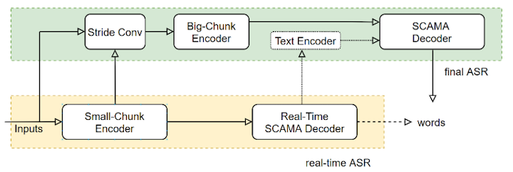

---
tasks:
- auto-speech-recognition
model-type:
- Two pass model
domain:
- audio
frameworks:
- pytorch
backbone:
- transformer/conformer
metrics:
- CER
license: Apache License 2.0
language: 
- cn
tags:
- FunASR
- UniASR
- Alibaba
- Offline
datasets:
  train:
  - 50,000 hour industrial Mandarin task
  test:
  - 50,000 hour industrial Mandarin task
indexing:
   results:
   - task:
       name: Automatic Speech Recognition
     dataset:
       name: 50,000 hour industrial Mandarin task
       type: audio    # optional
       args: 16k sampling rate, 8358 characters  # optional
     metrics:
       - type: CER
         value: 9.73%  # float
         description: beamsearch with of 5, withou lm, common avg.
         args: default
widgets:
  - task: auto-speech-recognition
    inputs:
      - type: audio
        name: input
        title: 音频
    examples:
      - name: 1
        title: 示例1
        inputs:
          - name: input
            data: git://example/asr_example.wav 
    inferencespec:
      cpu: 8 #CPU数量
      memory: 4096
finetune-support: True
---

# UniASR 模型介绍

## <strong>[FunASR开源项目介绍](https://github.com/alibaba-damo-academy/FunASR)</strong>
<strong>[FunASR](https://github.com/alibaba-damo-academy/FunASR)</strong>希望在语音识别的学术研究和工业应用之间架起一座桥梁。通过发布工业级语音识别模型的训练和微调，研究人员和开发人员可以更方便地进行语音识别模型的研究和生产，并推动语音识别生态的发展。让语音识别更有趣！

[**github仓库**](https://github.com/alibaba-damo-academy/FunASR)
| [**最新动态**](https://github.com/alibaba-damo-academy/FunASR#whats-new) 
| [**环境安装**](https://github.com/alibaba-damo-academy/FunASR#installation)
| [**服务部署**](https://www.funasr.com)
| [**模型库**](https://github.com/alibaba-damo-academy/FunASR/tree/main/model_zoo)
| [**联系我们**](https://github.com/alibaba-damo-academy/FunASR#contact)


## 模型原理介绍

UniASR 模型是一种2遍刷新模型（Two pass）端到端语音识别模型。日益丰富的业务需求，不仅要求识别效果精度高，而且要求能够实时地进行语音识别。一方面，离线语音识别系统具有较高的识别准确率，但其无法实时的返回解码文字结果，并且，在处理长语音时，容易发生解码重复的问题，以及高并发解码超时的问题等；另一方面，流式系统能够低延时的实时进行语音识别，但由于缺少下文信息，流式语音识别系统的准确率不如离线系统，在流式业务场景中，为了更好的折中实时性与准确率，往往采用多个不同时延的模型系统。为了满足差异化业务场景对计算复杂度、实时性和准确率的要求，常用的做法是维护多种语音识别系统，例如，CTC系统、E2E离线系统、SCAMA流式系统等。在不同的业务场景使用不同的模型和系统，不仅会增加模型生产成本和迭代周期，而且会增加引擎以及服务部署的维护成本。因此，我们设计了离线流式一体化语音识别系统——UniASR。UniASR同时具有高精度和低延时的特点，不仅能够实时输出语音识别结果，而且能够在说话句尾用高精度的解码结果修正输出，与此同时，UniASR采用动态延时训练的方式，替代了之前维护多套延时流式系统的做法。通过设计UniASR语音识别系统，我们将之前多套语音识别系统架构统一为一套系统架构，一个模型满足所有业务场景，显著的降低了模型生产和维护成本。
其模型结构如下图所示：


<div align=center>

</div>

UniASR模型结构如上图所示，包含离线语音识别部分和流式语音识别部分。其中，离线与流式部分通过共享一个动态编码器（Encoder）结构来降低计算量。流式语音识别部分是由动态时延 Encoder 与流式解码器（Decoder）构成。动态时延 Encoder 采用时延受限有句记忆单元的自注意力（LC-SAN-M）结构；流式 Decoder 采用动态 SCAMA 结构。离线语音识别部分包含了降采样层（Sride Conv）、Big-Chunk Encoder、文本Encoder与SCAMA Decoder。为了降低刷新输出结果的尾点延时，离线识别部分采用大Chunk 流式结构。其中，Stride Conv结构是为了降低计算量。文本 Encoder 增加了离线识别的语义信息。为了让模型能够具有不同延时下进行语音识别的能力，我们创新性地设计了动态时延训练机制，使得模型能够同时满足不同业务场景对延时和准确率的要求。
根据业务场景特征，我们将语音识别需求大致分为3类： 

    低延迟实时听写：如电话客服，IOT语音交互等，该场景对于尾点延迟非常敏感，通常需要用户说完以后立马可以得到识别结果。  
    流式实时听写：如会议实时字幕，语音输入法等，该场景不仅要求能够实时返回语音识别结果，以便实时显示到屏幕上，而且还需要能够在说话句尾用高精度识别结果刷新输出。  
    离线文件转写：如音频转写，视频字幕生成等，该场景不对实时性有要求，要求在高识别准确率情况下，尽可能快的转录文字。  

为了同时满足上面3种业务场景需求，我们将模型分成3种解码模式，分别对应为：  

    fast 模式：只有一遍解码，采用低延时实时出字模式；  
    normal 模式：2遍解码，第一遍低延时实时出字上屏，第二遍间隔3～6s（可配置）对解码结果进行刷新；  
    offline 模式：只有一遍解码，采用高精度离线模式；  

在模型部署阶段，通过发包指定该次语音识别服务的场景模式和延时配置。这样，通过UniASR系统，我们统一了离线流式语音识别系统架构，提高模型识别效果的同时，不仅降低了模型生产成本和迭代周期，还降低了引擎以及服务部署维护成本。目前我们提供的语音识别服务基本都是基于UniASR。  

## 基于ModelScope推理
输入音频支持wav与pcm格式音频，以wav格式输入为例，支持以下几种输入方式：

- wav文件路径，例如：data/test/audios/asr_example.wav
- wav二进制数据，格式bytes，例如：用户直接从文件里读出bytes数据或者是麦克风录出bytes数据
- wav文件url，例如：https://isv-data.oss-cn-hangzhou.aliyuncs.com/ics/MaaS/ASR/test_audio/asr_example.wav
- wav文件测试集，目录结构树必须符合如下要求：
    ```
    datasets directory 
    │
    └───wav
    │   │
    │   └───test
    │       │   xx1.wav
    │       │   xx2.wav
    │       │   ...
    │   
    └───transcript
        │   data.text  # hypothesis text
    ```

#### api调用范例
```python
from modelscope.pipelines import pipeline
from modelscope.utils.constant import Tasks

inference_16k_pipline = pipeline(
    task=Tasks.auto_speech_recognition,
    model='iic/speech_UniASR-large_asr_2pass-zh-cn-16k-common-vocab8358-tensorflow1-offline', model_revision="v2.0.4")

rec_result = inference_16k_pipline('https://modelscope.oss-cn-beijing.aliyuncs.com/test/audios/asr_example.wav')
print(rec_result)
```

如果是pcm格式输入音频，调用api时需要传入音频采样率参数audio_fs，例如：
```python
rec_result = inference_16k_pipline('https://modelscope.oss-cn-beijing.aliyuncs.com/test/audios/asr_example.pcm', fs=16000)
```


## 基于FunASR进行推理

下面为快速上手教程，测试音频（[中文](https://isv-data.oss-cn-hangzhou.aliyuncs.com/ics/MaaS/ASR/test_audio/vad_example.wav)，[英文](https://isv-data.oss-cn-hangzhou.aliyuncs.com/ics/MaaS/ASR/test_audio/asr_example_en.wav)）

### 可执行命令行
在命令行终端执行：

```shell
funasr +model=paraformer-zh +vad_model="fsmn-vad" +punc_model="ct-punc" +input=vad_example.wav
```

注：支持单条音频文件识别，也支持文件列表，列表为kaldi风格wav.scp：`wav_id   wav_path`

### python示例
#### 非实时语音识别
```python
from funasr import AutoModel
# paraformer-zh is a multi-functional asr model
# use vad, punc, spk or not as you need
model = AutoModel(model="paraformer-zh", model_revision="v2.0.4",
                  vad_model="fsmn-vad", vad_model_revision="v2.0.4",
                  punc_model="ct-punc-c", punc_model_revision="v2.0.4",
                  # spk_model="cam++", spk_model_revision="v2.0.2",
                  )
res = model.generate(input=f"{model.model_path}/example/asr_example.wav", 
            batch_size_s=300, 
            hotword='魔搭')
print(res)
```
注：`model_hub`：表示模型仓库，`ms`为选择modelscope下载，`hf`为选择huggingface下载。

#### 实时语音识别

```python
from funasr import AutoModel

chunk_size = [0, 10, 5] #[0, 10, 5] 600ms, [0, 8, 4] 480ms
encoder_chunk_look_back = 4 #number of chunks to lookback for encoder self-attention
decoder_chunk_look_back = 1 #number of encoder chunks to lookback for decoder cross-attention

model = AutoModel(model="paraformer-zh-streaming", model_revision="v2.0.4")

import soundfile
import os

wav_file = os.path.join(model.model_path, "example/asr_example.wav")
speech, sample_rate = soundfile.read(wav_file)
chunk_stride = chunk_size[1] * 960 # 600ms

cache = {}
total_chunk_num = int(len((speech)-1)/chunk_stride+1)
for i in range(total_chunk_num):
    speech_chunk = speech[i*chunk_stride:(i+1)*chunk_stride]
    is_final = i == total_chunk_num - 1
    res = model.generate(input=speech_chunk, cache=cache, is_final=is_final, chunk_size=chunk_size, encoder_chunk_look_back=encoder_chunk_look_back, decoder_chunk_look_back=decoder_chunk_look_back)
    print(res)
```

注：`chunk_size`为流式延时配置，`[0,10,5]`表示上屏实时出字粒度为`10*60=600ms`，未来信息为`5*60=300ms`。每次推理输入为`600ms`（采样点数为`16000*0.6=960`），输出为对应文字，最后一个语音片段输入需要设置`is_final=True`来强制输出最后一个字。

#### 语音端点检测（非实时）
```python
from funasr import AutoModel

model = AutoModel(model="fsmn-vad", model_revision="v2.0.4")

wav_file = f"{model.model_path}/example/asr_example.wav"
res = model.generate(input=wav_file)
print(res)
```

#### 语音端点检测（实时）
```python
from funasr import AutoModel

chunk_size = 200 # ms
model = AutoModel(model="fsmn-vad", model_revision="v2.0.4")

import soundfile

wav_file = f"{model.model_path}/example/vad_example.wav"
speech, sample_rate = soundfile.read(wav_file)
chunk_stride = int(chunk_size * sample_rate / 1000)

cache = {}
total_chunk_num = int(len((speech)-1)/chunk_stride+1)
for i in range(total_chunk_num):
    speech_chunk = speech[i*chunk_stride:(i+1)*chunk_stride]
    is_final = i == total_chunk_num - 1
    res = model.generate(input=speech_chunk, cache=cache, is_final=is_final, chunk_size=chunk_size)
    if len(res[0]["value"]):
        print(res)
```

#### 标点恢复
```python
from funasr import AutoModel

model = AutoModel(model="ct-punc", model_revision="v2.0.4")

res = model.generate(input="那今天的会就到这里吧 happy new year 明年见")
print(res)
```

#### 时间戳预测
```python
from funasr import AutoModel

model = AutoModel(model="fa-zh", model_revision="v2.0.4")

wav_file = f"{model.model_path}/example/asr_example.wav"
text_file = f"{model.model_path}/example/text.txt"
res = model.generate(input=(wav_file, text_file), data_type=("sound", "text"))
print(res)
```

更多详细用法（[示例](https://github.com/alibaba-damo-academy/FunASR/tree/main/examples/industrial_data_pretraining)）


## 微调

详细用法（[示例](https://github.com/alibaba-damo-academy/FunASR/tree/main/examples/industrial_data_pretraining)）


# 使用方式以及适用范围

运行范围
- 支持Linux-x86_64、Mac和Windows运行。

使用方式
- 直接推理：可以直接对输入音频进行解码，输出目标文字。
- 微调：加载训练好的模型，采用私有或者开源数据进行模型训练。

使用范围与目标场景
- 建议输入语音时长在20s以下。


### 模型局限性以及可能的偏差

考虑到特征提取流程和工具以及训练工具差异，会对CER的数据带来一定的差异（<0.1%），推理GPU环境差异导致的RTF数值差异。

## 训练数据介绍

5万小时16K通用数据

## 模型训练流程

在AISHELL-1与AISHELL-2等学术数据集中，采用随机初始化的方式直接训练模型。
在工业大数据上，建议加载预训练好的离线端到端模型作为初始，训练UniASR。

### 预处理

可以直接采用原始音频作为输入进行训练，也可以先对音频进行预处理，提取FBank特征，再进行模型训练，加快训练速度。

## 数据评估及结果

|        model        | clean（CER%） | common (CER%) |
|:-------------------:|:---------:|:---------:|
| offline |   5.84   |   9.73   |
| normal  |   6.11   |   10.42   | 
| fast(900ms)   |   8.60   |   12.67   |

### 相关论文以及引用信息

```BibTeX
@inproceedings{gao2020universal,
  title={Universal ASR: Unifying Streaming and Non-Streaming ASR Using a Single Encoder-Decoder Model},
  author={Gao, Zhifu and Zhang, Shiliang and Lei, Ming and McLoughlin, Ian},
  booktitle={arXiv preprint arXiv:2010.14099},
  year={2010}
}
```
